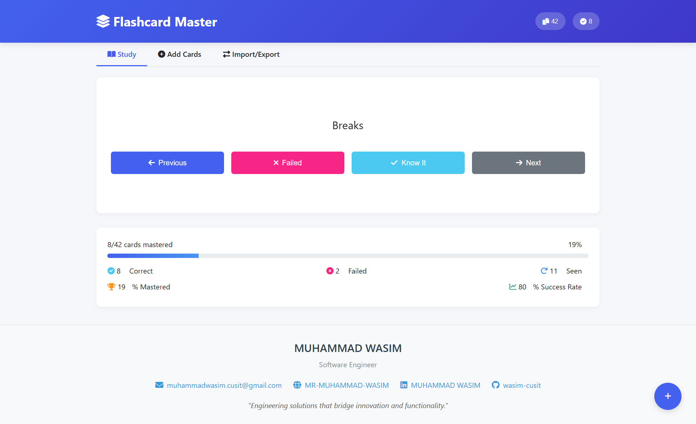

# 🧠 Flashcard Master

**Flashcard Master** is a lightweight and intuitive flashcard application designed to help users study and memorize concepts more effectively. Whether you're preparing for exams or learning a new topic, this tool makes studying easier with a clean, interactive interface.

---

## ✨ Features

- 📋 Create and manage custom flashcards
- 🔄 Flip cards to test memory
- ✅ Track correct and incorrect answers
- 🧩 Simple and responsive UI
- 💾 Data saved locally in the browser (no login required)

---

## 🚀 Live Demo

👉 [Try it here](https://wasim-cusit.github.io/MR_flashcard/)

---

## 🖼️ Screenshot



---

## 🔧 Technologies Used

- HTML5
- CSS3 / TailwindCSS (optional)
- JavaScript (Vanilla)

---

## 📥 Installation

```bash
# Clone the repository
git clone https://github.com/yourusername/MR_flashcard.git
cd MR_flashcard
